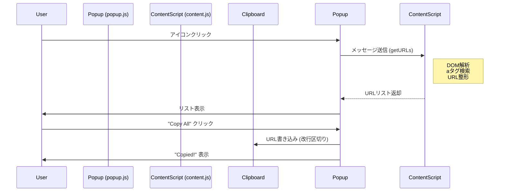

# YouTube URL Extractor

[English](./README.md)

## 概要
YouTubeのページ（検索結果やチャンネル動画一覧など）から動画URLを抽出し、クリップボードにコピーするためのChrome拡張機能です。NotebookMLなどのツールへの入力補助として使用します。

## 処理フロー (Process Flow)

### 1. 起動 (Startup)
- ユーザーがブラウザのツールバーにある拡張機能アイコンをクリックします。
- `popup.html` が表示され、`popup.js` が実行されます。

### 2. メッセージ送信 (Messaging)
- `popup.js` は、現在アクティブなタブに対して `getURLs` というメッセージを送信します（Chrome Runtime APIを使用）。

### 3. URL抽出 (Extraction) - `content.js`
- YouTubeのページ内で動作している `content.js` がメッセージを受け取ります。
- DOM（ページ構造）を解析し、`href` に `/watch?v=` を含む `<a>` タグ（リンク）をすべて探します。
- URLパラメータ（`&index=` や `&list=` など）を除去し、クリーンな動画URL（`https://www.youtube.com/watch?v=VIDEO_ID`）を生成します。
- 重複を排除してリスト化します。

### 4. 結果返却 (Response)
- `content.js` は抽出したURLリストを `popup.js` に返送します。

### 5. 表示とコピー (Display & Copy)
- `popup.js` は受け取ったURLの件数を表示し、リストを描画します。
- ユーザーが「Copy All to Clipboard」ボタンをクリックすると、リスト内のURLが改行区切りのテキストとしてクリップボードに書き込まれます。

