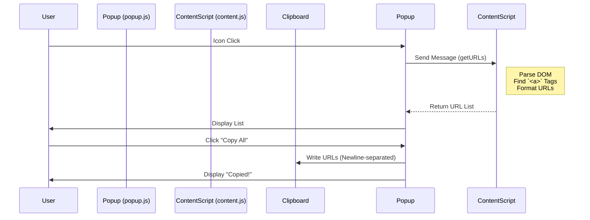

# YouTube URL Extractor

[日本語 (Japanese)](./README.ja.md)

## Overview
A Chrome extension designed to extract video URLs from YouTube pages (e.g., search results, channel video lists) and copy them to the clipboard.

## Processing Flow

### 1. Startup
- The user clicks the extension’s icon located in the browser toolbar.
- The `popup.html` is displayed, and the `popup.js` script is executed.

### 2. Messaging
- `popup.js` sends a message called `getURLs` to the currently active tab (using the Chrome Runtime API).

### 3. URL Extraction - `content.js`
- `content.js`, running within the YouTube page, receives the message.
- It parses the DOM (Document Object Model) and looks for all `<a>` tags (links) whose `href` attribute contains `/watch?v=`.
- It removes unnecessary URL parameters (e.g., `&index=` or `&list=`) to generate clean video URLs (`https://www.youtube.com/watch?v=VIDEO_ID`).
- It eliminates duplicates and creates a list.

### 4. Response
- `content.js` returns the extracted URL list to `popup.js`.

### 5. Display & Copy
- `popup.js` displays the number of URLs received and renders them as a list.
- When the user clicks the "Copy All to Clipboard" button, the list of URLs is written to the clipboard as newline-separated text.

